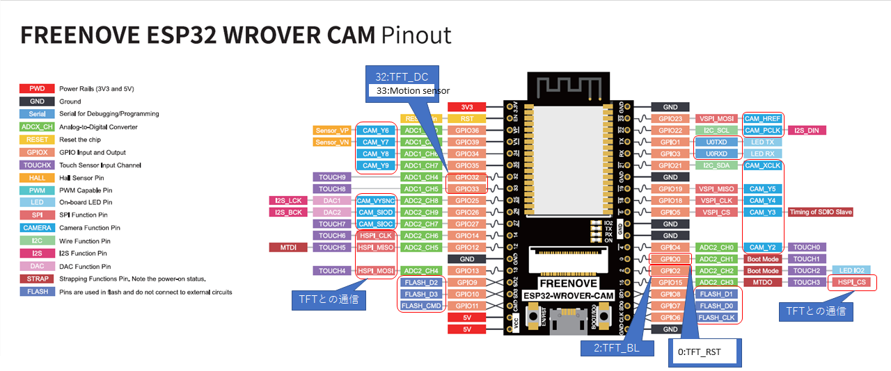
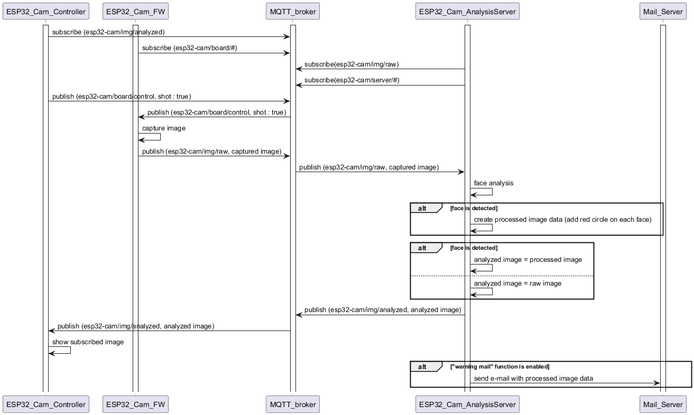

# ESP32-CAM-System
This is a toy using ESP32-WROVER Board

## Outline
### System connection diagram


### Requirements
#### ESP32_Cam_Controller
The app is intended for Android with API34 or later.

#### ESP32_Cam_AnalysisServer
1. This script is developed using following libraries.
    - Cython                        3.0.10
    - numpy                         1.26.1
    - onnx                          1.16.1
    - onnxruntime                   1.18.0
    - insightface                   0.7.3

1. Setup the mail server of email address to use for sending warning email to be able to use from external application.

#### ESP32_Cam_FW
1. Settings
You have to make "wifi_setting.h" in the same directory with mqtt.cpp.
The SSID and password of the WiFi router to be used must be defined in this file like following.
```
const char *ssid_Router = "hoge";
const char *password_Router = "fuga";
```

2. Pin Assign
Pin assign of ESP32 is as follows.

| GPIO No | Funtion        | I/O | note                                                                                        |
|---------|----------------|-----|---------------------------------------------------------------------------------------------|
| GPIO0   | TFT_RST        | OUT | connected to RST of TFT                                                                     |
| GPIO1   | U0TXD          | OUT | Debug/Programing Serial                                                                     |
| GPIO2   | TFT_BL         | OUT | connected to BL of TFT                                                                      |
| GPIO3   | U0RXD          | IN  | Debug/Programing Serial                                                                     |
| GPIO4   | CAM_Y2         | -   | used to control the attached CAM                                                            |
| GPIO5   | CAM_Y3         | -   | used to control the attached CAM                                                            |
| GPIO6   | FLASH_CLK      | -   | used in flash, and it must not be connected to external circuits                            |
| GPIO7   | FLASH_D0       | -   | used in flash, and it must not be connected to external circuits                            |
| GPIO8   | FLASH_D1       | -   | used in flash, and it must not be connected to external circuits                            |
| GPIO9   | FLASH_D2       | -   | used in flash, and it must not be connected to external circuits                            |
| GPIO10  | FLASH_D3       | -   | used in flash, and it must not be connected to external circuits                            |
| GPIO11  | FLASH_CMD      | -   | used in flash, and it must not be connected to external circuits                            |
| GPIO12  | HSPI_MISO      | OUT | it is not connected but HSPI is used to control TFT.<br>this pin is not recommended to use. |
| GPIO13  | HSPI_MOSI      | OUT | connected to SDA of TFT                                                                     |
| GPIO14  | HSPI_CLK       | OUT | connected to SCL of TFT                                                                     |
| GPIO15  | HSPI_CS        | OUT | connected to CS of TFT                                                                      |
| GPIO18  | CAM_Y4         | -   | used to control the attached CAM                                                            |
| GPIO19  | CAM_Y5         | -   | used to control the attached CAM                                                            |
| GPIO21  | CAM_XCLK       | -   | used to control the attached CAM                                                            |
| GPIO22  | CAM_PCLK       | -   | used to control the attached CAM                                                            |
| GPIO23  | CAM_HREF       | -   | used to control the attached CAM                                                            |
| GPIO25  | CAM_VYSNC      | -   | used to control the attached CAM                                                            |
| GPIO26  | CAM_SIOD       | -   | used to control the attached CAM                                                            |
| GPIO27  | CAM_SIOC       | -   | used to control the attached CAM                                                            |
| GPIO32  | TFT_DC         | OUT | connected to DC of TFT                                                                      |
| GPIO33  | MOTION_SENS_IN | IN  | signal from the motion sensor.<br>asserted to HIGH when detected.                           |
| GPIO34  | CAM_Y8         | -   | used to control the attached CAM                                                            |
| GPIO35  | CAM_Y9         | -   | used to control the attached CAM                                                            |
| GPIO36  | CAM_Y6         | -   | used to control the attached CAM                                                            |
| GPIO39  | CAM_Y7         | -   | used to control the attached CAM                                                            |

<br>

3. Used devices
Devices to connect are following.
- TFT Display Module : WINGONEER 1.8inch TFT LCD Display Module ST7735S
- Motion sensor : HC-SR501


### Function
#### ESP32_Cam_Controller
This is the Android Application to control ESP32_Cam system (Front end of system).
- You can order to capture realtime image with this app.
    - Enable/disable to take photo periodicaly.
        - Additionaly, interval time [msec] of this function.
- This app can change settings of ESP32_Cam_FW and ESP32_Cam_AnalysisServer.
    - Enable/disable to send warning Email if unknown person who is not accompanied by registered people is detected.
        - Additionaly, what email address to which send.
- It can check image which is result of analysis at ESP32_Cam_AnalysisServer.
    - If any faces are detected, image with red circle on each detected faces will be shown.
    - If any faces are NOT detected, raw image will be shown.

#### ESP32_Cam_AnalysisServer
This is the backend program of system developed with Python.

Following process are executed.
1. Receiving image from ESP32-WROVER Board when capture fucntion is proceeded.
1. Analysing whether there are any faces or not.
1. If any faces are detected execute following functions.
    1. Creating proceeded image to emphasis each faces.
    1. Check similarity with some faces registered.
    1. If there are any unkown faces and there are no registered faces, send warning_email if necessary.
1. Publishing proceeded image data via MQTT.

#### ESP32_Cam_FW
This is the FW of ESP32-WROVER Board.

It takes pictures in real time or periodically according to the instructions of ESP32_Cam_Controller.

After that, publish image data via MQTT.


## Sequence Outline
### Take photo and analyze it


### Setting
TODO Sequence Diaglam


## MQTT
### MQTT Setting
TODO setting about MQTT

### MQTT Messages
| topic                        | payload                    | from         | to     | note                        |
|------------------------------|----------------------------|--------------|--------|-----------------------------|
| esp32-cam/img/raw            | captured image data        | Board        | Server |                             |
| esp32-cam/img/analyzed       | analyzed image data        | Server       | App    | used if set to send         |
| esp32-cam/board/setting      | change setting of board    | App          | Board  |                             |
| esp32-cam/board/control      | control message for board  | App          | Board  |                             |
| esp32-cam/server/setting     | change setting of server   | App          | Server |                             |
| esp32-cam/server/control     | control message for server | App          | Server | it is not used but reserved |
| esp32-cam/controller/setting | current settings           | Board/Server | App    |                             |

#### esp32-cam/board/setting

| key           | value       | note                                             |
|---------------|-------------|--------------------------------------------------|
| interval_shot | true/false  | enable/disable interval shot                     |
| interval      | number (>0) | interval time [msec] for executing interval shot |
| human_sensor  | true/false  | enable/disable human sensor                      |

#### esp32-cam/board/control

| key    | value | note                     |
|--------|-------|--------------------------|
| shot   | true  | take onetime capture     |
| reqset | true  | require current settings |

#### esp32-cam/server/setting

| key          | value            | note                                                                                                     |
|--------------|------------------|----------------------------------------------------------------------------------------------------------|
| warning_mail | true/false       | send image with e-mail if unknown faces have been detected<br>(and there is no face which is registered) |
| mail_addr    | [address string] | destination email address to which warning email is sent                                                 |

#### esp32-cam/server/control
| key    | value | note                     |
|--------|-------|--------------------------|
| reqset | true  | require current settings |

#### esp32-cam/controller/setting

| key           | value            | note                                                                                                     |
|---------------|------------------|----------------------------------------------------------------------------------------------------------|
| interval_shot | true/false       | enable/disable interval shot                                                                             |
| interval      | number (>0)      | interval time [msec] for executing interval shot                                                         |
| human_sensor  | true/false       | enable/disable human sensor                                                                              |
| warning_mail  | true/false       | send image with e-mail if unknown faces have been detected<br>(and there is no face which is registered) |
| mail_addr     | [address string] | destination email address to which warning email is sent                                                 |
