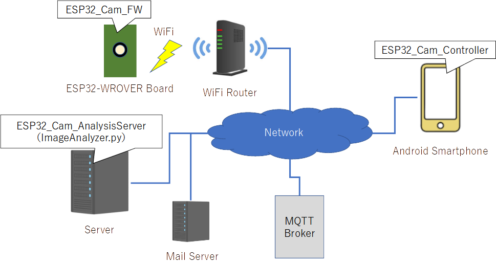

# ESP32-CAM-System
This is a toy using ESP32-WROVER Board

## Outline
### System connection diagram


### Requirements
#### ESP32_Cam_Controller
The app is intended for Android with API34 or later.

#### ESP32_Cam_AnalysisServer
1. This script is developed using following libraries.
    - Cython                        3.0.10
    - numpy                         1.26.1
    - onnx                          1.16.1
    - onnxruntime                   1.18.0
    - insightface                   0.7.3

1. Setup the mail server of email address to use for sending warning email to be able to use from external application.

#### ESP32_Cam_FW
You have to make "wifi_setting.h" in the same directory with mqtt.cpp.
The SSID and password of the WiFi router to be used must be defined in this file like following.
```
const char *ssid_Router = "hoge";
const char *password_Router = "fuga";
```

### Function
#### ESP32_Cam_Controller
This is the Android Application to control ESP32_Cam system (Front end of system).
- You can order to capture realtime image with this app.
    - Enable/disable to take photo periodicaly.
        - Additionaly, interval time [msec] of this function.
- This app can change settings of ESP32_Cam_FW and ESP32_Cam_AnalysisServer.
    - Enable/disable to send warning Email if unknown person who is not accompanied by registered people is detected.
        - Additionaly, what email address to which send.
- It can check image which is result of analysis at ESP32_Cam_AnalysisServer.
    - If any faces are detected, image with red circle on each detected faces will be shown.
    - If any faces are NOT detected, raw image will be shown.

#### ESP32_Cam_AnalysisServer
This is the backend program of system developed with Python.

Following process are executed.
1. Receiving image from ESP32-WROVER Board when capture fucntion is proceeded.
1. Analysing whether there are any faces or not.
1. If any faces are detected execute following functions.
    1. Creating proceeded image to emphasis each faces.
    1. Check similarity with some faces registered.
    1. If there are any unkown faces and there are no registered faces, send warning_email if necessary.
1. Publishing proceeded image data via MQTT.

#### ESP32_Cam_FW
This is the FW of ESP32-WROVER Board.

It takes pictures in real time or periodically according to the instructions of ESP32_Cam_Controller.

After that, publish image data via MQTT.


## Sequence Outline
### Take photo and analyze it
@startuml Take photo and analyze sequence
    participant ESP32_Cam_Controller as app
    participant ESP32_Cam_FW         as board
    participant MQTT_broker          as broker
    participant ESP32_Cam_AnalysisServer          as svr
    participant Mail_Server          as mailsvr

    activate broker
    activate app
    activate svr
    activate board
    activate mailsvr

    app -> broker : subscribe (esp32-cam/img/analyzed)
    board -> broker : subscribe (esp32-cam/board/#)
    svr -> broker : subscribe(esp32-cam/img/raw)
    svr -> broker : subscribe(esp32-cam/server/#)

    app -> broker : publish (esp32-cam/board/control, shot : true)
    broker -> board : publish (esp32-cam/board/control, shot : true)
    board -> board : capture image
    board -> broker : publish (esp32-cam/img/raw, captured image)
    broker -> svr : publish (esp32-cam/img/raw, captured image)
    svr -> svr : face analysis
    alt face is detected
        svr -> svr : create processed image data (add red circle on each face)
    end

    alt face is detected
        svr -> svr : analyzed image = processed image
    else
        svr -> svr : analyzed image = raw image
    end
    svr -> broker : publish (esp32-cam/img/analyzed, analyzed image)
    broker -> app : publish (esp32-cam/img/analyzed, analyzed image)
    app -> app : show subscribed image

    alt "warning mail" function is enabled
        svr -> mailsvr : send e-mail with processed image data
    end
@enduml

### Setting
TODO Sequence Diaglam


## MQTT
### MQTT Setting
TODO setting about MQTT

### MQTT Messages
| topic                    | payload                    | from   | to     | note                        |
|--------------------------|----------------------------|--------|--------|-----------------------------|
| esp32-cam/img/raw        | captured image data        | Board  | Server |                             |
| esp32-cam/img/analyzed   | analyzed image data        | Server | App    | used if set to send         |
| esp32-cam/board/setting  | change setting of board    | App    | Board  |                             |
| esp32-cam/board/control  | control message for board  | App    | Board  |                             |
| esp32-cam/server/setting | change setting of server   | App    | Server |                             |
| esp32-cam/server/control | control message for server | App    | Server | it is not used but reserved |

#### esp32-cam/board/setting

| key           | value       | note                                             |
|---------------|-------------|--------------------------------------------------|
| interval_shot | true/false  | enable/disable interval shot                     |
| interval      | number (>0) | interval time [msec] for executing interval shot |

#### esp32-cam/board/control

| key  | value | note                 |
|------|-------|----------------------|
| shot | true  | take onetime capture |

#### esp32-cam/server/setting

| key           | value            | note                                                                                                     |
|---------------|------------------|----------------------------------------------------------------------------------------------------------|
| warning_email | true/false       | send image with e-mail if unknown faces have been detected<br>(and there is no face which is registered) |
| email_address | [address string] | destination email address to which warning email is sent                                                 |
